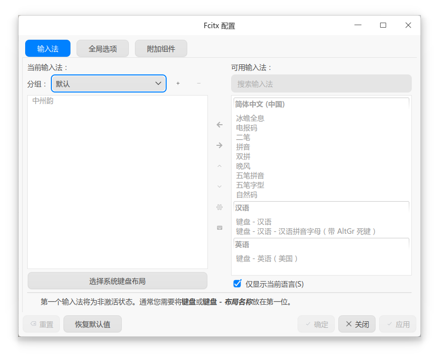

# 🐧 Linux 通用部署指引 (Fcitx5)

在 Linux Fcitx5 平台上，Rime 并不能独立运行，而是作为 **Fcitx5 (小企鹅输入法)** 的一个底层插件（即“中州韵”）来工作。请仔细阅读以下步骤，尤其注意依赖包的安装与按键冲突的防范。

---

### 1. 安装核心依赖环境

根据您使用的 Linux 发行版，选择对应的安装方式：

#### 📦 发行版 A：Ubuntu / Debian 等 APT 系 (手动部署)

请打开终端，执行以下命令安装 Fcitx5 框架、Rime 插件以及必须的 Lua 和八股文模型依赖：
```bash
sudo apt install fcitx5-rime fcitx5 librime-plugin-lua librime1 librime-bin librime-plugin-octagram
```
*(注：安装完成后，请继续执行下方的 第 2 步 下载并手动解压万象方案。)*

#### 📦 发行版 B：Arch Linux (AUR / ArchCN 仓库一键安装)

如果您是 Arch 用户并启用了 **[Arch Linux CN 仓库](https://www.archlinuxcn.org/archlinux-cn-repo-and-mirror/)**，您可以直接通过包管理器一键安装万象方案，免去手动解压的烦恼。

* **基础版 (Base) 包名**：`rime-wanxiang-[拼写方案名]`（如自然码：`rime-wanxiang-zrm`）

* **增强版 (Pro) 包名**：`rime-wanxiang-pro-[拼写方案名]`（如自然码：`rime-wanxiang-pro-zrm`）

```bash
# 例如安装万象自然码 Pro 版
sudo pacman -S rime-wanxiang-pro-zrm
```
*(注：Arch 仓库包会自动处理依赖。如果您通过此方法安装，可直接跳过第 2、4 步。)*

---

### 2. 下载万象素材 (非 Arch 用户)

如果您使用的是 APT 或其他手动包管理方式，请下载万象方案包与模型文件：

* **方案压缩包 (.zip)**：[CNB 极速下载](https://cnb.cool/amzxyz/rime-wanxiang/-/releases) | [GitHub 下载](https://github.com/amzxyz/rime_wanxiang/releases)

* **语法模型**：[wanxiang-lts-zh-hans.gram](https://cnb.cool/amzxyz/rime-wanxiang/-/releases/download/model/wanxiang-lts-zh-hans.gram)

!!! tip "指南：Base 包与 Pro 包该下哪个？"

    * **🟢 Base (标准版) 包**：主打省心顺滑，无需折腾，打字体验类似主流大厂输入法。

    * **🔵 Pro (增强版) 分包**：专为硬核辅码玩家打造，进行了词库编码层辅助码的携带。下载时认准自己使用的“辅助码类型”即可。

---

### 3. Fcitx5 基础设置与“排雷”

安装好软件后，请打开系统或 Fcitx5 的 **输入法配置面板 (UI)**，进行以下关键设置：

1. **添加中州韵**：在可用插件库中找到 **【中州韵】**，将其添加到左侧当前使用的输入法列表中。

2. **清理冗余**：建议将左侧除了【键盘-英语】和【中州韵】之外的其他中文输入法全部移除或移动到右侧。中英文切换有中州韵就完全够用了。

{ width="600" style="display: block; margin: 1rem auto; border-radius: 8px; box-shadow: 0 4px 12px rgba(97, 161, 101, 0.15);" }

!!! warning "⚠️ 极度重要：清理 Fcitx5 快捷键防冲突"

    在使用 Fcitx5 时，**非必要请将 Fcitx5 面板中无用的快捷键全部清空！**

    因为万象方案内部已经对快捷键做了极其深度的配置，如果 Fcitx5 也拦截了按键，会导致严重的冲突。

    **核心原则：能用 Rime 配置的，尽量使用 Rime，保持“一盘棋”思路。**

---

### 4. 手动置入方案与模型 (非 Arch 用户)

打开终端或文件管理器，进入 Fcitx5 的 Rime 用户目录：

**绝对路径：**
```text
~/.local/share/fcitx5/rime
```

1. **放入模型**：将下载好的 `wanxiang-lts-zh-hans.gram` 放入该目录。
2. **解压方案**：将万象方案解压后的**所有文件**（切勿包含根目录）拖入该目录。如果提示覆盖，请允许。

!!! danger "Fcitx5 皮肤与外观设定须知"
    Rime 作为插件存在时，其界面完全被 Fcitx5 接管。

    * Rime 原本的皮肤配置参数（如 `weasel.yaml` / `squirrel.yaml` 等）在 Linux 下**完全无效**。

    * 设置候选词**竖向/横向**排列，需要在 Fcitx5 的设置面板中调整。

    * 自定义皮肤请遵循 Fcitx5 的规则，将皮肤主题放入 `~/.local/share/fcitx5/theme` 目录下。

---

### 5. 执行重新部署

点击系统托盘（状态栏）的 **【企鹅】或【键盘】** 图标 → 选择 **【重新部署】** (或重启 Fcitx5)。

> ⏳ **耐心等待**：由于 Rime 是源码式部署，需要将词库进行转换并对 Lua 等插件进行初始化加载。首次部署的编译量极大，可能需要 **1 分钟以上**。请耐心等待部署成功的通知，期间不要进行任何操作，避免卡顿影响心情。

---

### 6. 初始指令与个性化切换

部署成功后，万象的默认状态如下：

* 🟢 **Base 标准版**：默认开启 **全拼**。
* 🔵 **Pro 增强版**：默认开启 **自然码双拼**。

!!! tip "强烈建议执行一次激活指令"
    即使默认方案恰好是您需要的，我们也建议您利用万象强大的 [斜杠指令](../slash_commands.md) 进行一次主动切换。这一步操作涉及到四个方案文件的自定义输入类型，不仅仅是主方案，背后的逻辑参照custom patch相关教程
    
    例如，**任意输入框，中文模式** 直接打字输入 **`/zrm`** (切换自然码双拼) 或 **`/flypy`** (切换小鹤双拼)，然后再去状态栏点击一次 **【重新部署】**。这能确保万象的底层按键绑定完美契合您的输入习惯。

    --8<-- "docs/doc/slash_commands.md"