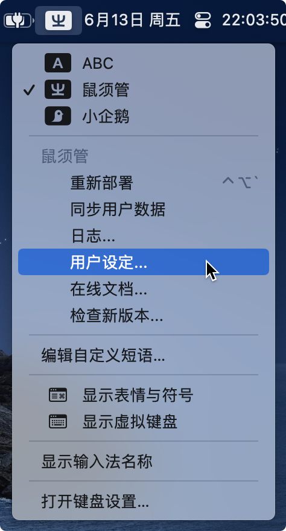

# 🍎 Squirrel (鼠须管) 部署指南

欢迎在 macOS 平台使用万象。鼠须管作为 Mac 上最正统的 Rime 前端，与万象的契合度极高。请按以下步骤完成部署：

---

### 1. 下载必要素材

在开始安装前，请确保您已经下载了最新的**前端软件**、**万象方案包**与**语法模型**：

**📦 1. 下载鼠须管前端 (Squirrel)**

* [:octicons-download-24: 前往 GitHub Releases 获取最新版](https://github.com/rime/squirrel/releases)

**📦 2. 下载万象拼音方案**

* ⚡ **国内高速节点 (CNB，免翻墙)**：[:octicons-link-external-24: 点击前往下载](https://cnb.cool/amzxyz/rime-wanxiang/-/releases)

* 🌍 **国际开源节点 (GitHub)**：[:octicons-link-external-24: 点击前往下载](https://github.com/amzxyz/rime-wanxiang/releases)

**📦 3. 下载语法模型**

* [:octicons-download-24: wanxiang-lts-zh-hans.gram](https://cnb.cool/amzxyz/rime-wanxiang/-/releases/download/model/wanxiang-lts-zh-hans.gram)

!!! tip "指南：Base 包与 Pro 包该下哪个？"
    * **🟢 Base (标准版) 包**：主打省心顺滑，无需折腾，打字体验类似主流大厂输入法。
    * **🔵 Pro (增强版) 分包**：专为硬核辅码玩家打造，进行了词库编码层辅助码的携带。下载时认准自己使用的“辅助码类型”即可。
    > 🎯 **定心丸**：万象底层极其灵活。“拼音的输入方式”（全拼、各家双拼）在安装后都能通过简单指令随时切换！

---

### 2. 开启 Rime 用户文件夹

万象的所有配置文件都需要放入鼠须管的**用户文件夹**中。

{ width="600" style="display: block; margin: 1rem auto; border-radius: 8px; box-shadow: 0 4px 12px rgba(97, 161, 101, 0.15);" }

* **快捷入口**：点击 Mac 顶部菜单栏右侧的 **【㞢】** 字图标，在下拉菜单中点击「**用户设定...**」。

* **绝对路径**：或者直接在“访达 (Finder)”中使用 `⇧⌘G` (前往文件夹)，输入以下路径：

    ```text
    ~/Library/Rime
    ```
    *(它等同于 `/Users/您的用户名/Library/Rime`)*

### 3. 解压并置入万象方案

将您下载的万象方案压缩包 `.zip` 解压。

!!! warning "⚠️ 核心警告：切勿嵌套文件夹！"
    请进入解压出来的文件夹**内部**，将里面的**所有内容全选**，直接拖入并覆盖到 Rime 用户目录中。**绝不能**把形如 `rime-wanxiang-**` 的外部根文件夹扔进去！

!!! info "配置文件说明（按需覆盖）"

    * `default.yaml`：Rime 全局快捷键行为，如需与其他方案共存请留意。

    * `squirrel.yaml`：鼠须管专属皮肤外观配置，覆盖后原有的皮肤将被替换。

{ width="600" style="display: block; margin: 1rem auto; border-radius: 8px; box-shadow: 0 4px 12px rgba(97, 161, 101, 0.15);" }
*(全部放入后，您的目录层级应该如上方演示图所示，请顺手删除 `luna` 开头的文件和 `build` 文件夹。)*

### 4. 置入语法模型

将刚才下载的语法模型文件 **`wanxiang-lts-zh-hans.gram`** 直接拖入这个目录中即可。

### 5. 执行重新部署

点击 Mac 顶部菜单栏的 **【㞢】** 字图标，点击 **【重新部署】**。

> ⏳ **耐心等待**：由于rime是源码式+部署将词库进行转换并对lua等插件进行初始化加载，首次部署的编译量极大，可能需要 **1 分钟以上**。请耐心等待系统右下角弹出部署成功的提示，不要进行任何其他操作，避免体验到卡顿影响心情。

### 6. 初始指令与个性化切换

部署成功后，万象的默认状态如下：

* 🟢 **Base 标准版**：默认开启 **全拼**。
* 🔵 **Pro 增强版**：默认开启 **自然码双拼**。

!!! tip "强烈建议执行一次激活指令"
    即使默认方案恰好是您需要的，我们也建议您利用万象强大的 [斜杠指令](../slash_commands.md) 进行一次主动切换。这一步操作涉及到四个方案文件的自定义输入类型，不仅仅是主方案，背后的逻辑参照custom patch相关教程
    
    例如，**任意输入框，中文模式** 直接打字输入 **`/zrm`** (切换自然码双拼) 或 **`/flypy`** (切换小鹤双拼)，然后再去状态栏点击一次 **【重新部署】**。这能确保万象的底层按键绑定完美契合您的输入习惯。

    --8<-- "docs/doc/slash_commands.md"