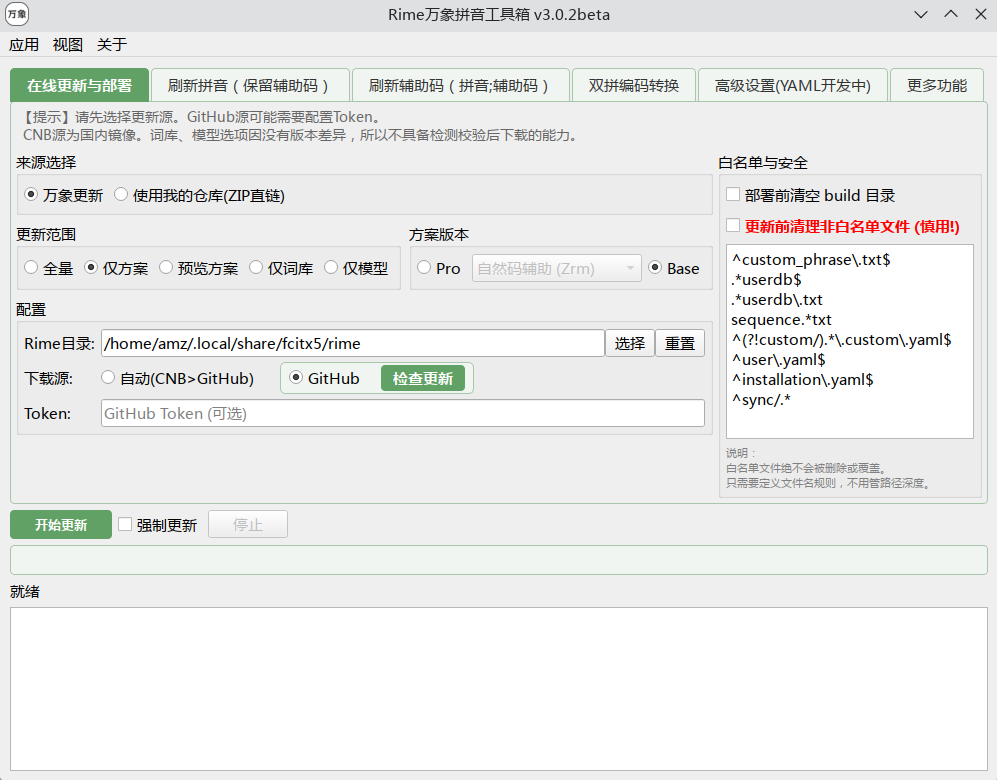

# 🧰 万象工具箱 (All-in-one Toolchain)

如果您追求最极致、最无脑的安装与维护体验，**万象工具箱 (Wanxiang Tools)** 是您的首选神兵。它集成了下载、解压、覆盖、白名单保护以及重新部署于一体，真正实现了 Rime 方案的“一键式”生命周期管理。

---

### 1. 全平台版本选择

万象工具箱针对不同系统架构提供了深度优化的版本，请根据您的设备按需下载：

| 平台 | 软件版本说明 | 推荐人群 |
| :--- | :--- | :--- |
| :material-microsoft-windows: **Windows** | **绿色免安装版** (解压即用) | Windows 小狼毫用户 |
| :material-apple: **macOS** | **ARM 芯片原生版** (Apple Silicon) | M1/M2/M3 系列 Mac 用户 |
| :material-android: **Android** | **安卓原生 App** | 同文、小企鹅 Android 用户 |
| :material-linux: **Linux** | **.deb (通用)** / **Arch Linux** | Ubuntu、Deepin、Arch 用户 |

[:octicons-download-24: 前往获取万象工具箱](https://github.com/amzxyz/RIME-LMDG/releases/tag/tool){ .md-button .md-button--primary style="margin-top: 10px;" }

---

### 2. 核心功能亮点

* **🚀 智能更新流**：自动检测 GitHub 或 CNB 镜像源，秒速拉取最新资源并自动解压覆盖，无需手动开关文件夹。
* **🛡️ 白名单保护 (White-list)**：**最核心的保命功能**。您可以配置受保护的文件名单，即使云端有同名文件，工具也绝不会覆盖您的私人配置。
* **🧹 双重重置引擎**：
    1.  **构建重置**：仅清空 `build` 目录，强制 Rime 重新编译词库，解决 99% 的灵异 Bug。
    2.  **纯净重置**：仅保留白名单文件，其余陈旧、残留、改名后的废弃文件全部扫地出门，瞬间恢复官版纯净状态。

---

### 3. 更新模式说明

在工具箱界面，您会看到四个核心更新按钮。请根据您的具体维护需求进行选择：

* **🌟 全量更新**
    * **操作内容**：下载并覆盖包含主方案、Lua 插件、所有词库及语法模型在内的所有文件。
    * **适用场景**：**首次安装** 或 **版本跨度极大** 时的全面升级。

* **📖 仅词库**
    * **操作内容**：仅拉取最新的 `.dict.yaml` 词库文件。
    * **适用场景**：日常维护，追求最新的流行语库和修正词频，而不希望变动任何功能配置。

* **⚙️ 仅方案**
    * **操作内容**：仅更新核心的 `.schema.yaml` 方案配置及 Lua 脚本。
    * **适用场景**：当万象发布了新的功能、修复了按键逻辑或 Lua 魔法插件时使用。

* **🧠 仅模型**
    * **操作内容**：仅更新 `wanxiang-lts-zh-hans.gram` 语法模型。
    * **适用场景**：当底层语义理解模型有精度提升或体积优化时使用。

---

### 4. 简易使用流程

1.  **准备阶段**：下载对应平台的压缩包并解压，建议将其放在非系统盘的固定目录下。
2.  **配置白名单**：在执行更新前，先在工具设置中勾选或编辑您的 **白名单文件**（如 `default.custom.yaml` 等），确保您的私人调优不被覆盖。
3.  **一键更新**：点击上述四个更新模式中的任意一个，等待进度条走完。
4.  **部署生效**：
    * **PC 端**：工具通常会自动触发 Rime 的重新部署。
    * **移动端**：建议在工具操作完后，手动进入输入法 App 点击“重新部署”。

如果您偏好轻量级脚本或非 Windows 环境，可以使用社区贡献的更新工具：

* **Python / PowerShell 脚本**：
👉 [rime-wanxiang-update-tools](https://github.com/rimeinn/rime-wanxiang-update-tools)
* **Go 语言更新器**：
👉 [rime-wanxiang-updater](https://github.com/ca-x/rime-wanxiang-updater)

!!! tip "小建议"
    对于大多数用户，建议 **想起来，点一点**，即可保持万象处于最佳战斗状态，毕竟我们的词库进化速度不是一般项目可比。