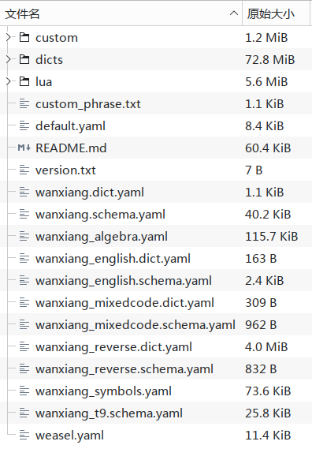

# 🪟 Weasel (小狼毫) 部署指南

欢迎在 Windows 平台使用万象。小狼毫作为 Windows 上最正统的 Rime 前端，与万象的契合度极高。请按以下步骤完成部署：

---

### 1. 下载必要素材

在开始安装前，请确保您已经下载了最新的**前端软件**和**万象方案包**：

**📦 1. 下载小狼毫前端 (Weasel)**
* [:octicons-download-24: 前往 GitHub Releases 获取最新版](https://github.com/rime/weasel/releases)
> 💡 **避坑提示：** 强烈推荐直接在 GitHub 页面下载最新版。Rime 官网 (rime.im) 上的安装包更新往往存在滞后。

**📦 2. 下载万象拼音方案**

请根据您的网络环境选择下载源，前往 Releases 页面获取最新版方案压缩包（`.zip`）：

* ⚡ **国内高速节点 (CNB，免翻墙)**：[:octicons-link-external-24: 点击前往下载](https://cnb.cool/amzxyz/rime-wanxiang/-/releases)

* 🌍 **国际开源节点 (GitHub)**：[:octicons-link-external-24: 点击前往下载](https://github.com/amzxyz/rime_wanxiang/releases)

**📦 3. 下载语法模型**

* [:octicons-download-24: wanxiang-lts-zh-hans.gram](https://cnb.cool/amzxyz/rime-wanxiang/-/releases/download/model/wanxiang-lts-zh-hans.gram)

!!! tip "指南：Base 包与 Pro 包该下哪个？"
    万象提供了不同策略的安装包，请按您的输入习惯选择：
    
    * **🟢 Base (标准版) 包**：主打省心顺滑，无需折腾，打字体验类似主流大厂输入法，特色功能也很多。
    * **🔵 Pro (增强版) 分包**：专为硬核辅码玩家打造，进行了词库编码层辅助码的携带。**下载时您只需认准自己使用的“辅助码类型”挑选对应的包即可。**

    > 🎯 **定心丸**：万象的底层极其灵活。无论您下载的是 Base 还是 Pro，**“拼音的输入方式”（如全拼、自然码、小鹤等各种双拼）都可以在安装后通过简单的指令自由切换**。所以在下载阶段，您完全不需要为拼音类型纠结！

---

### 2. 开启 Rime 用户文件夹

万象的所有配置文件都需要放入小狼毫的**用户文件夹**中。

* **快捷入口**：右键点击 Windows 状态栏右下角的 **【中】** 字图标，在弹出的菜单中选择「**用户文件夹**」。
* **绝对路径**：如果找不到图标，您可以打开任意文件夹，在地址栏粘贴以下路径并回车：
    ```text
    %APPDATA%\Rime
    ```
    *(它等同于 `C:\Users\您的用户名\AppData\Roaming\Rime`)*

### 3. 解压并置入万象方案

将您刚刚下载好的万象方案压缩包 `.zip` 解压。

!!! warning "⚠️ 核心警告：切勿嵌套文件夹！"
    请进入解压出来的文件夹**内部**，将里面的**所有内容（文件和子文件夹）全选**，直接拖入并覆盖到 Rime 用户目录中。

    **绝不能**把形如 `rime_wanxiang-**` 的外部根文件夹直接扔进去，否则小狼毫将完全无法读取！

!!! info "配置文件说明（按需覆盖）"
    压缩包内包含了两个特殊的前端文件：

    * `default.yaml`：Rime 快捷键与全局行为配置，如需与其他方案共存请考虑这个文件的综合配置情况。

    * `weasel.yaml`：小狼毫专属皮肤外观配置，有他存在自带的皮肤就看不到了，请自行取舍。

    如果您之前自己精心调过小狼毫的快捷键或皮肤，在复制时可以选择**跳过**覆盖这两个文件。

{ width="600" style="display: block; margin: 1rem auto; border-radius: 8px; box-shadow: 0 4px 12px rgba(97, 161, 101, 0.15);" }

*(全部放入后，您的目录层级应该如上方演示图所示。)*

### 4. 置入语法模型

将万象配套的语法模型文件 **`wanxiang-lts-zh-hans.gram`** 复制，并粘贴到刚刚打开的 Rime 用户目录中。如提示占用，需要在小狼毫右下角右键菜单中选择退出算法框架，即可正常粘贴，文件都放置就绪后，检查目录是否存在luna开头的文件和文件夹，有就将其删除，同时一并将build文件夹删除。

### 5. 执行重新部署

右键状态栏的 **【中】** 字图标，点击 **【重新部署】**。

> ⏳ **耐心等待**：由于rime是源码式+部署将词库进行转换并对lua等插件进行初始化加载，首次部署的编译量极大，可能需要 **1 分钟以上**。请耐心等待系统右下角弹出部署成功的提示，不要进行任何其他操作，避免体验到卡顿影响心情。

### 6. 初始指令与个性化切换

部署成功后，万象的默认状态如下：

* 🟢 **Base 标准版**：默认开启 **全拼**。
* 🔵 **Pro 增强版**：默认开启 **自然码双拼**。

!!! tip "强烈建议执行一次激活指令"
    即使默认方案恰好是您需要的，我们也建议您利用万象强大的 [斜杠指令](../slash_commands.md) 进行一次主动切换。这一步操作涉及到四个方案文件的自定义输入类型，不仅仅是主方案，背后的逻辑参照custom patch相关教程
    
    例如，**任意输入框，中文模式** 直接打字输入 **`/zrm`** (切换自然码双拼) 或 **`/flypy`** (切换小鹤双拼)，然后再去状态栏点击一次 **【重新部署】**。这能确保万象的底层按键绑定完美契合您的输入习惯。

    --8<-- "docs/dco/slash_commands.md"